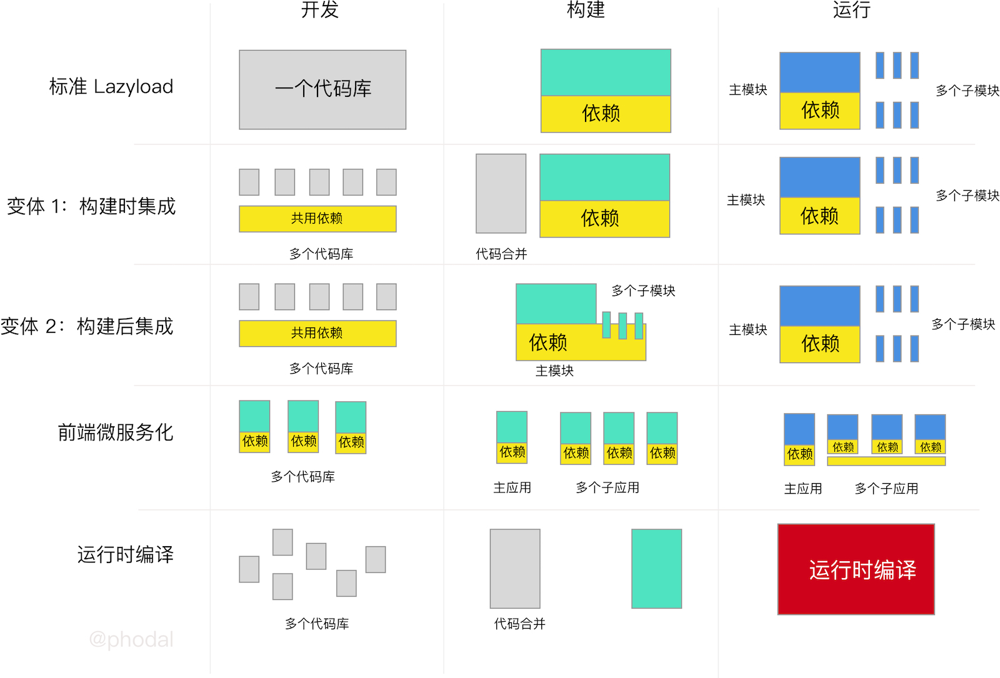

# 微前端的那些事儿

大型 Angular 应用的四种拆分策略
===

上一个月，我们花了大量的时间不熂设计方案来拆分一个大型的 Angular 应用。从使用 Angular 的 Lazyload 到前端微服务化，进行了一系列的讨论。最后，我们终于有了结果，采用的是 Lazyload 变体：**构建时集成代码** 的方式。

在这个过程中，我们做了大量的方案设计与对比，便想写一篇文章对比一下之前的结果。先看一下图：



标准 LazyLoad：开发、构建、运行一体

变体-构建时集成：开发分离，构建时集成，运行一体

变体-构建后集成：开发分离，构建分离，运行一体

前端微服务化：开发、构建、运行分离

JIT：Excused ME?


标准 LazyLoad
---

适用场景：单一团队，依赖库少、业务单一


LazyLoad 变体 1：构建时集成
---

适用场景：多团队，依赖库少、业务单一


LazyLoad 变体 2：构建后集成
---

适用场景：多团队，依赖库少、业务单一

前端微服务化
---

适用场景：多团队，依赖库多、业务复杂

JIT
---

适用场景：Hello, world

总对比
---


x       | 标准 Lazyload | 	构建时集成  | 构建后集成   | 应用独立 
--------|--------------|------------|-------------|-------------
依赖管理 |	统一管理	   | 统一管理   | 统一管理  | 各应用独立管理
部署方式 |	统一部署	   | 统一部署	 | 可单独部署。更新依赖时，需要全量部署 | 可完全独立部署
首屏加载 |	依赖在同一个文件，加载速度慢 | 依赖在同一个文件，加载速度慢 | 依赖在同一个文件，加载速度慢	| 依赖各自管理，首页加载快
首次加载应用、模块	| 只加载模块，速度快	 | 只加载模块，速度快 | 只加载模块，速度快  | 单独加载，加载略慢 
前期构建成本 |	低 | 设计构建流程| 	设计构建流程 | 设计通讯机制与加载方式
维护成本    |	一个代码库不好管理	| 多个代码库不好统一 | 后期需要维护组件依赖 | 后期维护成本低
打包优化  |	可进行摇树优化、AoT 编译、删除无用代码| 可进行摇树优化、AoT 编译、删除无用代码 | 应用依赖的组件无法确定，不能删除无用代码	| 可进行摇树优化、AoT 编译、删除无用代码

如何解构单体前端应用——前端应用的微服务式拆分
===


> 刷新页面？路由拆分？No，动态加载组件。

本文分为以下四部分：

 - 前端微服务化思想介绍
 - 微前端的设计理念
 - 实战微前端架构设计
 - 基于 Mooa 进行前端微服务化

前端微服化
---

对于前端微服化来说，有这么一些方案：

 - Web Component 显然可以一个很优秀的基础架构。然而，我们并不可能去大量地复写已有的应用。
 - iFrame。你是说真的吗？
 - 另外一个微前端框架 Single-SPA，显然是一个更好的方式。然而，它并非 Production Ready。
 - 通过路由来切分应用，而这个跳转会影响用户体验。
 - 等等。

因此，当我们考虑前端微服务化的时候，我们希望：

 - 独立部署
 - 独立开发
 - 技术无关
 - 不影响用户体验

### 独立开发

在过去的几星期里，我花费了大量的时间在学习 Single-SPA 的代码。但是，我发现它在开发和部署上真的太麻烦了，完全达不到独立部署地标准。按 Single-SPA 的设计，我需要在入口文件中声名我的应用，然后才能去构建：

```
declareChildApplication('inferno', () => import('src/inferno/inferno.app.js'), pathPrefix('/inferno'));
```

同时，在我的应用里，我还需要去指定我的生命周期。这就意味着，当我开发了一个新的应用时，必须更新两份代码：主工程和应用。这时我们还极可能在同一个源码里工作。 

当出现多个团队的时候，在同一份源码里工作，显然变得相当的不可靠——比如说，对方团队使用的是 Tab，而我们使用的是 2 个空格，隔壁的老王用的是 4 个空格。

### 独立部署

一个单体的前端应用最大的问题是，构建出来的 js、css 文件相当的巨大。而微前端则意味着，这个文件被独立地拆分成多个文件，它们便可以独立去部署应用。

### 我们真的需要技术无关吗？

等等，我们是否真的需要**技术无关**？如果我们不需要技术无关的话，微前端问题就很容易解决了。

事实上，对于大部分的公司和团队来说，技术无关只是一个无关痛痒的话术。当一家公司的几个创始人使用了 Java，那么极有可能在未来的选型上继续使用 Java。除非，一些额外的服务来使用 Python 来实现人工智能。因此，在大部分的情况下，仍然是技术栈唯一。

对于前端项目来说，更是如此：一个部门里基本上只会选用一个框架。

于是，我们选择了 Angular。

### 不影响用户体验

使用路由跳转来进行前端微服务化，是一种很简单、高效的切分方式。然而，路由跳转地过程中，会有一个白屏的过程。在这个过程中，跳转前的应用和将要跳转的应用，都失去了对页面的控制权。如果这个应用出了问题，那么用户就会一脸懵逼。

理想的情况下，它应该可以被控制。

微前端的设计理念
---

### 设计理念一：中心化路由

互联网本质是去中心化的吗？不，DNS 决定了它不是。TAB，决定了它不是。

微服务从本质上来说，它应该是去中心化的。但是，它又不能是完全的去中心化。对于一个微服务来说，它需要一个**服务注册中心**：

> 服务提供方要注册通告服务地址，服务的调用方要能发现目标服务。

对于一个前端应用来说，这个东西就是路由。


从页面上来说，只有我们在网页上添加一个菜单链接，用户才能知道某个页面是可以使用的。


而从代码上来说，那就是我们需要有一个地方来管理我们的应用：**发现存在哪些应用，哪个应用使用哪个路由。

**管理好我们的路由，实际上就是管理好我们的应用**。

### 设计理念二：标识化应用

在设计一个微前端框架的时候，为**每个项目取一个名字的**问题纠结了我很久——怎么去规范化这个东西。直到，我再一次想到了康威定律：

> 系统设计(产品结构等同组织形式，每个设计系统的组织，其产生的设计等同于组织之间的沟通结构。


换句人话说，就是同一个组织下，不可能有两个项目的名称是一样的。

所以，这个问题很简单就解决了。

### 设计理念三：生命周期

Single-SPA 设计了一个基本的生命周期（虽然它没有统一管理），它包含了五种状态：

 - load，决定加载哪个应用，并绑定生命周期
 - bootstrap，获取静态资源
 - mount，安装应用，如创建 DOM 节点
 - unload，删除应用的生命周期
 - unmount，卸载应用，如删除 DOM 节点

于是，我在设计上基本上沿用了这个生命周期。显然，诸如 load 之类对于我的设计是多余的。

### 设计理念四：独立部署与配置自动化

从某种意义上来说，整个每系统是围绕着应用配置进行的。如果应用的配置能自动化，那么整个系统就自动化。

当我们只开发一个新的组件，那么我们只需要更新我们的组件，并更新配置即可。而这个配置本身也应该是能自动生成的。

实战微前端架构设计
---

基于以上的前提，系统的工作流程如下所示：


整体的工程流程如下所示：

1. 主工程在运行的时候，会去服务器获取最新的应用配置。
2. 主工程在获取到配置后，将一一创建应用，并为应用绑定生命周期。
3. 当主工程监测到路由变化的时候，将寻找是否有对应的路由匹配到应用。
4. 当匹配对对应应用时，则加载相应的应用。

故而，其对应的架构如下图所示：


### 独立部署与配置自动化

我们做的部署策略如下：我们的应用使用的配置文件叫 ``apps.json``，由主工程去获取这个配置。每次部署的时候，我们只需要将 ``apps.json`` 指向最新的配置文件即可。配置的文件类如下所示：

1. 96a7907e5488b6bb.json
2. 6ff3bfaaa2cd39ea.json
3. dcd074685c97ab9b.json

一个应用的配置如下所示：

```javascript
{
  "name": "help",
  "selector": "help-root",
  "baseScriptUrl": "/assets/help",
  "styles": [
    "styles.bundle.css"
  ],
  "prefix": "help",
  "scripts": [
    "inline.bundle.js",
    "polyfills.bundle.js",
    "main.bundle.js"
  ]
}
```

这里的 ``selector`` 对应于应用所需要的 DOM 节点，prefix 则是用于 URL 路由上。这些都是自动从 ``index.html`` 文件和 ``package.json`` 中获取生成的。

### 应用间路由——事件

由于现在的应用变成了两部分：主工程和应用部分。就会出现一个问题：**只有一个工程能捕获路由变化**。当由主工程去改变应用的二级路由时，就无法有效地传达到子应用。在这时，只能通过事件的方式去通知子应用，子应用也需要监测是否是当前应用的路由。

```javascript
if (event.detail.app.name === appName) {
  let urlPrefix = 'app'
  if (urlPrefix) {
    urlPrefix = `/${window.mooa.option.urlPrefix}/`
  }
  router.navigate([event.detail.url.replace(urlPrefix + appName, '')])
}
```

相似的，当我们需要从应用 A 跳转到应用 B 时，我们也需要这样的一个机制：

```
window.addEventListener('mooa.routing.navigate', function(event: CustomEvent) {
  const opts = event.detail
  if (opts) {
    navigateAppByName(opts)
  }
})
```

剩下的诸如 Loading 动画也是类似的。

使用 Mooa 进行
---

So，我们就有了前端微服务框架 Mooa。它基于 [single-spa](https://github.com/CanopyTax/single-spa) && [single-spa-angular-cli](https://github.com/PlaceMe-SAS/single-spa-angular-cli)，并且符合以上的设计思想。

GayHub 地址：[https://github.com/phodal/mooa](https://github.com/phodal/mooa)

对于主工程而言，只需要以下的几行代码就可以完成上面的功能：

```javascript
http.get<any[]>('/assets/apps.json')
  .subscribe(data => {
    data.map((config) => {
      that.mooa.registerApplication(config.name, config, mooaRouter.matchRoute(config.prefix));
    });
    this.mooa.start();
  });

this.router.events.subscribe((event: any) => {
  if (event instanceof NavigationEnd) {
    that.mooa.reRouter(event);
  }
});
```

并添加一个对应的子应用路由：

```javascript
{
  path: 'app/:appName/:route',
  component: HomeComponent
}
```

则如上所述的四个步骤。

对于子工程而言，则只需要一个对应的 Hook 操作：

```javascript
mooaPlatform.mount('help').then((opts) => {
  platformBrowserDynamic().bootstrapModule(AppModule).then((module) => {
    opts['attachUnmount'](module);
  });
});
```

并设置好对应的 base_href:

```
providers: [
  {provide: APP_BASE_HREF, useValue: mooaPlatform.appBase()},
]
```

嗯，就是这么简单。DEMO 视频如下：

Demo 地址见：[http://mooa.phodal.com/](http://mooa.phodal.com/)

GitHub 示例：[https://github.com/phodal/mooa](https://github.com/phodal/mooa)

前端微服务化：使用特制的 iframe 微服务化 Angular 应用
===

Angular 基于 Component 的思想，可以让其在一个页面上同时运行多个 Angular 应用；可以在一个 DOM 节点下，存在多个 Angular 应用，即类似于下面的形式：

```html
<app-home _nghost-c3="" ng-version="5.2.8">
  <app-help _nghost-c0="" ng-version="5.2.2" style="display:block;"><div _ngcontent-c0=""></div></app-help>
  <app-app1 _nghost-c0="" ng-version="5.2.3" style="display:none;"><nav _ngcontent-c0="" class="navbar"></div></app-app1>
  <app-app2 _nghost-c0="" ng-version="5.2.2" style="display:none;"><nav _ngcontent-c0="" class="navbar"></div></app-app2>
</app-home>
```

可这一样一来，难免需要做以下的一些额外的工作：

 - 创建子应用项目模板，以统一 Angular 版本
 - 构建时，删除子应用的依赖
 - 修改第三方模块

而在这其中最麻烦的就是**第三方模块**冲突问题。思来想去，在三月中旬，我在 Mooa 中添加了一个 iframe 模式。

iframe 微服务架构设计
---

在这里，总的设计思想和之前的《[如何解构单体前端应用——前端应用的微服务式拆分](https://www.phodal.com/blog/how-to-build-a-microfrontend-framework-mooa/)》中介绍是一致的：


主要过程如下：

 - 主工程在运行的时候，会去服务器获取最新的应用配置。
 - 主工程在获取到配置后，将一一创建应用，并为应用绑定生命周期。
 - 当主工程监测到路由变化的时候，将寻找是否有对应的路由匹配到应用。
 - 当匹配对对应应用时，则**创建或显示相应应用的 iframe**，并隐藏其它子应用的 iframe。

其加载形式与之前的 Component 模式并没有太大的区别：


而为了控制不同的 iframe 需要做到这么几件事：

 1. 为不同的子应用分配 ID
 2. 在子应用中进行 hook，以通知主应用：子应用已加载
 3. 在子应用中创建对应的事件监听，来响应主应用的 URL 变化事件
 4. 在主应用中监听子程序的路由跳转等需求

因为大部分的代码可以与之前的 [Mooa](https://github.com/phodal/mooa) 复用，于是我便在 Mooa 中实现了相应的功能。

微前端框架 Mooa 的特制 iframe 模式
---

iframe 可以创建一个**全新的独立的宿主环境**，这意味着我们的 Angular 应用之间可以相互独立运行，我们唯一要做的是：**建立一个通讯机制**。

它可以不修改子应用代码的情况下，可以直接使用。与此同时，它在一般的 iframe 模式进行了优化。使用普通的 iframe 模式，意味着：**我们需要加载大量的重复组件**，即使经过 Tree-Shaking 优化，它也将带来大量的重复内容。如果子应用过多，那么它在初始化应用的时候，体验可能就没有那么友好。但是与此相比，在初始化应用的时候，加载所有的依赖在主程序上，也不是一种很友好的体验。

于是，我就在想能不能创建一个更友好地 IFrame 模式，在里面对应用及依赖进行处理。如下，就是最后生成的页面的 iframe 代码：


```html
<app-home _nghost-c2="" ng-version="5.2.8">
  <iframe frameborder="" width="100%" height="100%" src="http://localhost:4200/assets/iframe.html" id="help_206547" style="display:block;"></iframe>
  <iframe frameborder="" width="100%" height="100%" src="http://localhost:4200/assets/iframe.html" id="app_235458 style="display:none;"></iframe>
</app-home>
```

对，两个 iframe 的 src 是一样的，但是它表现出来的确实是两个不同的 iframe 应用。那个 iframe.html 里面其实是没有内容的：

```html
<!doctype html>
<html lang="en">
<head>
  <meta charset="utf-8">
  <title>App1</title>
  <base href="/">
  <meta name="viewport" content="width=device-width,initial-scale=1">
  <link rel="icon" type="image/x-icon" href="favicon.ico">
</head>
<body>

</body>
</html>
```

（PS：详细的代码可以见 [https://github.com/phodal/mooa](https://github.com/phodal/mooa)）

只是为了创建 iframe 的需要而存在的，对于一个 Angular 应用来说，是不是一个 iframe 的区别并不大。但是，对于我们而言，区别就大了。我们可以使用自己的方式来控制这个 IFrame，以及我们所要加载的内容。如：

 - 共同 Style Guide 中的 CSS 样式。如，在使用 iframe 集成时，移除不需要的 <link>
 - 去除不需要重复加载的 JavaScript。如，打包时不需要的 zone.min.js、polyfill.js 等等

``注意``：对于一些共用 UI 组件而言，仍然需要重复加载。这也就是 iframe 模式下的问题。

微前端框架 Mooa iframe 通讯机制
---

为了在主工程与子工程通讯，我们需要做到这么一些事件策略：

### 发布主应用事件

由于，我们使用 Mooa 来控制 iframe 加载。这就意味着我们可以通过 ``document.getElementById`` 来获取到 iframe，随后通过 ``iframeEl.contentWindow`` 来发布事件，如下：

```typescript
let iframeEl: any = document.getElementById(iframeId)
if (iframeEl && iframeEl.contentWindow) {
  iframeEl.contentWindow.mooa.option = window.mooa.option
  iframeEl.contentWindow.dispatchEvent(
    new CustomEvent(MOOA_EVENT.ROUTING_CHANGE, { detail: eventArgs })
  )
}
```

这样，子应用就不需要修改代码，就可以直接接收对应的事件响应。


### 监听子应用事件

由于，我们也希望能直接在主工程中处理子程序的事件，并且不修改原有的代码。因此，我们也使用同样的方式来在子应用中监听主应用的事件：

```
iframeEl.contentWindow.addEventListener(MOOA_EVENT.ROUTING_NAVIGATE, function(event: CustomEvent) {
  if (event.detail) {
    navigateAppByName(event.detail)
  }
})
```

示例
---

同样的我们仍以 Mooa 框架作为示例，我们只需要在创建 mooa 实例时，配置使用 iframe 模式即可：

```typescript
this.mooa = new Mooa({
  mode: 'iframe',
  debug: false,
  parentElement: 'app-home',
  urlPrefix: 'app',
  switchMode: 'coexist',
  preload: true,
  includeZone: true
});

...

that.mooa.registerApplicationByLink('help', '/assets/help', mooaRouter.matchRoute('help'));
that.mooa.registerApplicationByLink('app1', '/assets/app1', mooaRouter.matchRoute('app1'));
this.mooa.start();

...
this.router.events.subscribe((event: any) => {
  if (event instanceof NavigationEnd) {
    that.mooa.reRouter(event);
  }
});
```

子程序则直接使用：[https://github.com/phodal/mooa-boilerplate](https://github.com/phodal/mooa-boilerplate) 就可以了。

