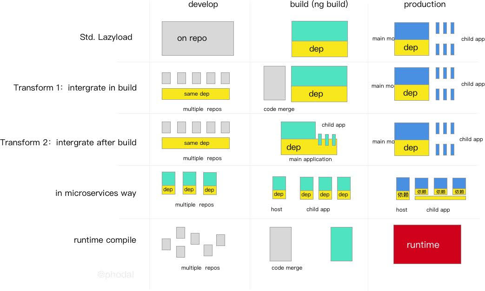
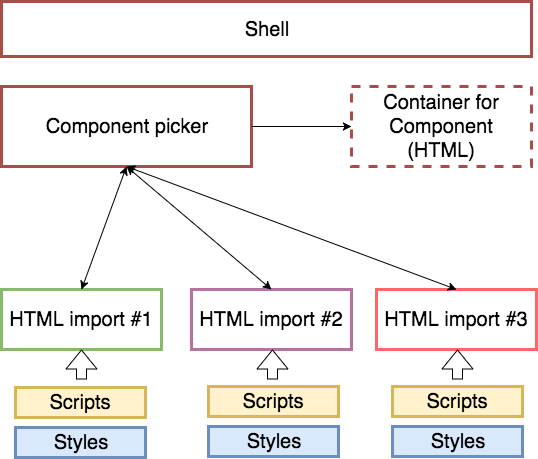
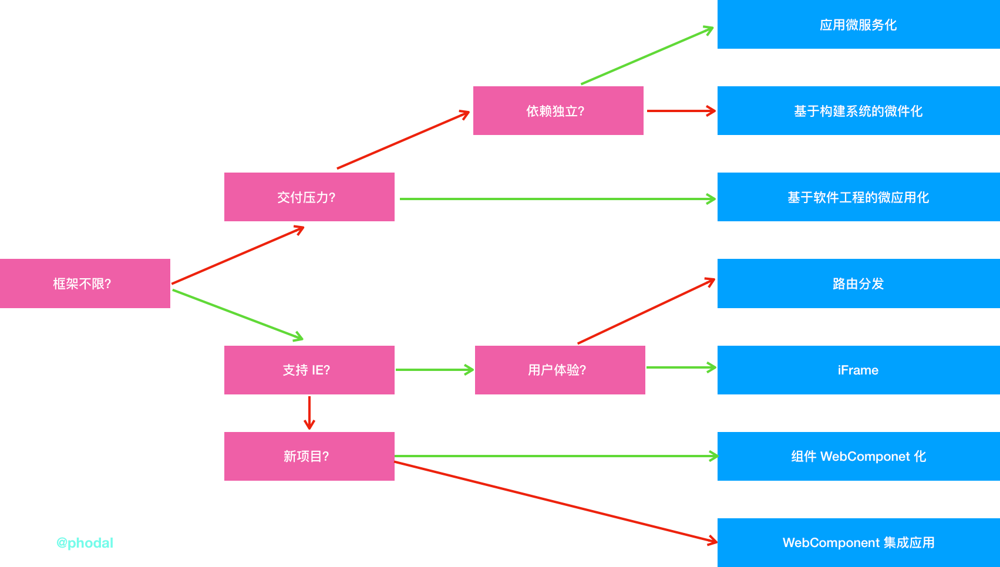
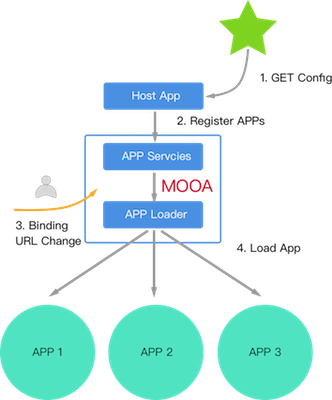
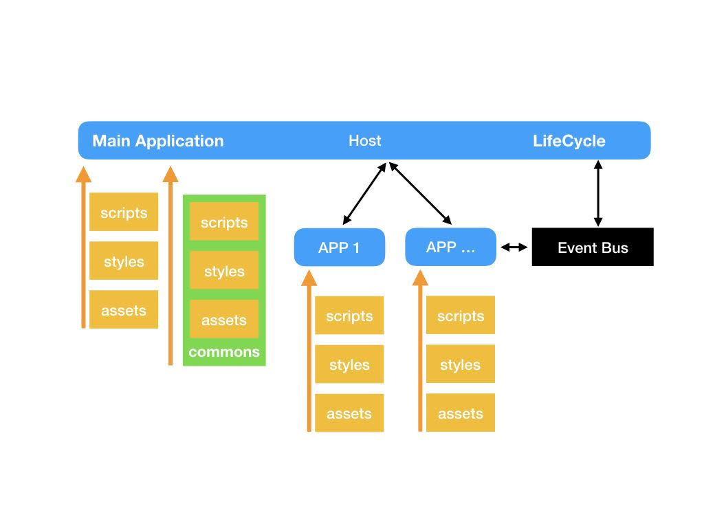
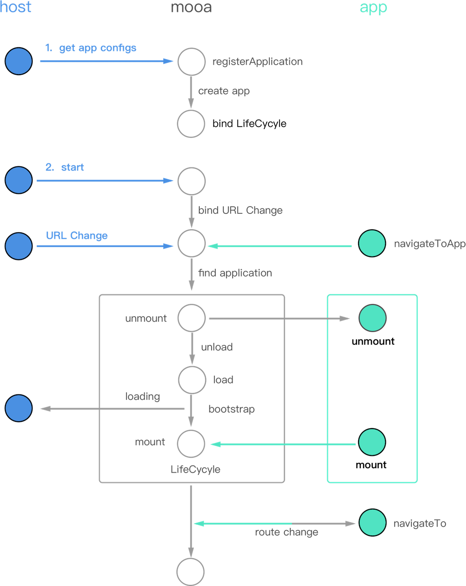

# Thinking in Microfrontend

> Micro-frontends is a microservice-like architecture that applies the concept of microservices to the browser side. Transforming to a mono-like applications from a single, single application to an application that combines multiple small front-end applications. Each frontend application can also be **standalone run**, **independent development**, **standalone deployment**.

At the same time, they can also be developed in parallel with **sharing components** - these components can be managed via NPM or Git Tag, Git Submodule etc.

**Note**: The front-end application here refers to a single-page application separated from the front and back. It is meaningful to talk about the micro-frontends on this basis.

TOC:

*   [Thinking in Microfrontend](#thinking-in-microfrontend)
*   [Why micro-frontends be popular – aggregation of web applications](#why-micro-frontends-be-popular-%E2%80%93-aggregation-of-web-applications)
    *   [Migration frontend legacy system](#migration-frontend-legacy-system-)
    *   [Backend decoupling, frontend aggregation](#backend-decoupling-frontend-aggregation)
    *   [Compatible with legacy systems](#compatible-with-legacy-systems)
*   [Six ways to implement a micro-frontends architecture](#six-ways-to-implement-a-micro-frontends-architecture)
    *   [Basic: Application Distribution Routing -> Route Distribution Application](#basic-application-distribution-routing---route-distribution-application)
        *   [Backend: Function Call -> Remote Call](#backend-function-call---remote-call)
        *   [Front End: Component Call -> Application Call](#front-end-component-call---application-call)
    *   [Route-dispatch micro-frontends](#route-dispatch-micro-frontends)
    *   [Create a container with iFrame](#create-a-container-with-iframe)
    *   [Homemade micro-frontends framework](#homemade-micro-frontends-framework-)
    *   [Combined integration: Widging applications](#combined-integration-widging-applications)
    *   [Pure Web Components technology build](#pure-web-components-technology-build)
    *   [Build with Web Components](#build-with-web-components)
        *   [Integrating existing frameworks in Web Components](#integrating-existing-frameworks-in-web-components)
        *   [Web Components integrated into existing frameworks](#web-components-integrated-into-existing-frameworks)
    *   [Compound type micro-frontends](#compound-type-micro-frontends)
    *   [Microfrontend Quick Selection Guide](#microfrontend-quick-selection-guide)
    *   [Comparison of micro front-end solutions: a brief comparison](#comparison-of-micro-front-end-solutions-a-brief-comparison)
    *   [Comparison of micro front-end solutions: complex ways](#comparison-of-micro-front-end-solutions-complex-ways)
*   [How to deconstruct mono front-end application - microservice splitting of front-end applications](#how-to-deconstruct-mono-front-end-application---microservice-splitting-of-front-end-applications)
    *   [front end microservice](#front-end-microservice)
        *   [Independent development](#independent-development)
        *   [Independent deployment](#independent-deployment)
        *   [Do we really need technology independently?](#do-we-really-need-technology-independently)
        *   [Does not affect the user experience](#does-not-affect-the-user-experience)
    *   [Micro-frontends design concept](#micro-frontends-design-concept)
        *   [Design Concept 1: Centralized Routing](#design-concept-1-centralized-routing)
        *   [Design Concept 2: Identification Application](#design-concept-2-identification-application)
        *   [Design Concept 3: Life Cycle](#design-concept-3-life-cycle)
        *   [Design Concept 4: Independent Deployment and Configuration Automation](#design-concept-4-independent-deployment-and-configuration-automation)
    *   [Practical micro-frontends architecture design](#practical-micro-frontends-architecture-design)
        *   [Independent Deployment and Configuration Automation](#independent-deployment-and-configuration-automation)
        *   [Inter-Application Routing - Events](#inter-application-routing---events)
*   [Four to split large Angular application to micro-frontends](#four-to-split-large-angular-application-to-micro-frontends)
    *   [1, front-end micro-services: routing lazy loading and its variants](#1-front-end-micro-services-routing-lazy-loading-and-its-variants)
    *   [2, microservice solution: sub-application mode](#2-microservice-solution-sub-application-mode)
    *   [Solution comparison](#solution-comparison)
        *   [Standard LazyLoad](#standard-lazyload)
        *   [LazyLoad Variant 1: Build-time integration](#lazyload-variant-1-build-time-integration)
        *   [LazyLoad variant 2: Post-build integration](#lazyload-variant-2-post-build-integration)
        *   [Front-end micro-service](#front-end-micro-service)
    *   [Total contrast](#total-contrast)


Why micro-frontends be popular – aggregation of web applications
===

> Adopting new technology, more is not because of advanced, but because it can solve the pain.

In the past, I have always had a doubt as to whether people really need microservices and whether they really need micro-frontends. After all, there is no silver bullet. When people consider whether to adopt a new architecture, in addition to considering its benefits, it still considers the large number of risks and technical challenges.

Migration frontend legacy system 
---

For past years, I have received some consultations on how to implement micro-frontends architecture. In the meantime, I found a very interesting thing: **Resolving the legacy system is the most important reason people use the micro-frontends solution**.

In these consultations, the situation encountered by the developers is similar to the situation I encountered before. My scenario is: design a new front-end architecture. They began to consider frontend with micro-services because of the legacy system.

In the past, single-page applications written using Backbone.js, Angular.js, Vue.js 1 and other frameworks have been running steadily online and have no new features. For such applications, there is no reason to waste time and paty effort to rewriting old applications. Applications in here, using old, no longer used technology stacks can be called legacy systems. However, these applications need to be combined into new applications. The more I've encountered is that the old app was written in Angular.js, and the new app started with Angular 2+. This is a very common technology stack for a business-stable IT team.

Under the premise of not rewriting the original system, it is possible to extract manpower to develop new business. It is not only a very attractive feature for business people; it is also quite challenging for technicians not to rewrite old business and to make some technical challenges.

Backend decoupling, frontend aggregation
---

A selling point for front-end microservices is also here, to be compatible with different types of front-end frameworks. This reminds me of the benefits of microservices and the reasons why many projects fall into microservices:

In the early, a big selling point for back-end microservices was that different technology stacks could be used to develop background applications. However, in fact, organizations and institutions that adopt a micro-service architecture are generally medium to large-scale. Compared with small and medium-sized, the selection of frameworks and languages ​​is more stringent, such as limiting the framework internally and limiting the language. Therefore, it is almost rare to fully utilize the different technology stacks to take advantage of microservices. In these large organizations, the main reason for adopting microservices is to **use the microservices architecture to decouple inter-service dependencies**.

In the frontend micro-services, it is exactly the opposite. The result people want more is **aggregation**, especially those applications of To B(to Bussiness).

In the past two or three years, mobile applications have shown a trend, users do not want to install so many applications. And often a large commercial company offers a range of applications. These applications also reflect, to some extent, the organizational structure of the company. However, in the eyes of users they are a company, they should only have one product. Similarly, this trend is also emerging on the desktop web. **Aggregation** has become a technology trend, and the aggregation in the front end is the micro-service architecture.

Compatible with legacy systems
---

Then, at this time, we need to use new technologies and new architectures to accommodate and be compatible with these old applications. The front-end micro-services just fits the selling point that people want.


Six ways to implement a micro-frontends architecture
===

Combined with my practice and research in the [micro-frontends](https://github.com/phodal/microfrontends) in the past six months, the micro-frontends architecture can generally be implemented in the following ways:

1. Use HTTP server routing to redirect multiple apps
2. Design communication and loading mechanisms on different frameworks, such as [Mooa](https://github.com/phodal/mooa) and [Single-SPA](https://github.com/CanopyTax/single-spa)
3. Build a single application by combining multiple independent applications and components
4. iFrame. Use iFrame and custom messaging mechanisms
5. Build an app with pure Web Components
6. Building with Web Components
7. Seperate application in build-time (TBC)
8. Seperate appliation in local build time (TBC)

Basic: Application Distribution Routing -> Route Distribution Application
---

In a monoli front-end, mono back-end application, there is a typical feature that routing is distributed by the **framework**, which assigns routes to corresponding components or internal services. What the microservice does in the process is to call the **function call** into a **remote call**, such as a remote HTTP call. The micro-frontends is similar, it is to change the component call** in the application into a more fine-grained **inter-application component call**, that is, we just distribute the route to the application component execution. Now you need to find the corresponding application based on the route, and then distribute it to the corresponding component by the application.

### Backend: Function Call -> Remote Call

In most CRUD-type web applications, there are some very similar patterns, namely: Home -> List -> Details:

 - Home page for displaying specific data or pages to users. These data are usually a finite number and are of multiple models.
 - List, the aggregation of the data model, which is typically a collection of data of a certain type, can see as many ** data summaries** (such as Google only returns 100 pages), typically see Google, Taobao / Ebay, Amazon search results page.
 - Details, showing as much content as possible for a single piece of data.

Here's an example of a Spring framework for returning to the home page:

```java
@RequestMapping(value="/")
Public ModelAndView homePage(){
   Return new ModelAndView("/WEB-INF/jsp/index.jsp");
}
```

For a detail page, it might look like this:

```java
@RequestMapping(value="/detail/{detailId}")
Public ModelAndView detail(HttpServletRequest request, ModelMap model){
   ....
   Return new ModelAndView("/WEB-INF/jsp/detail.jsp", "detail", detail);
}
```

So, in the case of microservices, it will look like this:

```java
@RequestMapping("/name")
Public String name(){
    String name = restTemplate.getForObject("http://account/name", String.class);
    Return Name" + name;
}
```

In the process, the backend has a service discovery service to manage the relationship between different microservices.

### Front End: Component Call -> Application Call

Formally speaking, the routing of the single front-end framework and the single-end back-end application are not much different: **Return the templates of different pages according to different routes**. An Angular examples:

```javascript
const appRoutes: Routes = [
  { path: 'index', component: IndexComponent },
  { path: 'detail/:id', component: DetailComponent },
];
```

And when we micro-service it, it may become the route of application A:

```javascript
const appRoutes: Routes = [
  { path: 'index', component: IndexComponent },
];
```

Plus the route of application B:

```javascript
const appRoutes: Routes = [
  { path: 'detail/:id', component: DetailComponent },
];
```

The key to the problem is: **How to dispatch routes to these different applications**. At the same time, it is also responsible for managing different front-end applications.

Route-dispatch micro-frontends
---

**route-distributed micro-frontends**, which distributes different services** to different, independent front-end applications by routing. It can usually be implemented by a reverse proxy of the HTTP server, or by the routing that comes with the application framework.

For the moment, the micro-frontends architecture through route distribution should be the most popular and easy-to-use "micro-frontends" solution. But this approach looks more like an aggregation of multiple front-end applications, that is, we just put together these different front-end applications to make them look like a complete whole. But they are not, every time a user applies from A to B, they often need to refresh the page.

In a project a few years ago, we were working on a **legacy system rewrite**. We have a migration plan:

1. First, use **static website generation** to dynamically generate the home page
2. Second, refactor the details page using the React stack
3. Finally, replace the search results page

The whole system is not a one-time migration, but a step by step. So when we need to complete the different steps, we need to go online, so we need to use Nginx for route distribution.

The following is an example of a Nginx configuration based on route distribution:

```nginx
http {
  server {
    listen       80;
    server_name  www.phodal.com;
    location /api/ {
      proxy_pass http://http://172.31.25.15:8000/api;
    }
    location /web/admin {
      proxy_pass http://172.31.25.29/web/admin;
    }
    location /web/notifications {
      proxy_pass http://172.31.25.27/web/notifications;
    }
    location / {
      proxy_pass /;
    }
  }
}}
}
```

In this example, requests for different pages are distributed to different servers.

Later, we used a similar approach on other projects, the main reason is: **cross-team collaboration**. When the team reaches a certain size, we have to face this problem. In addition, there is the problem of Angluar cliff-style upgrade. So, in this case, the user foreground uses Angular rewrite, and the background continues to use Angular.js and so on to keep the technology stack. In different scenarios, there are some similar technical decisions.

So in this case it works for the following scenarios:

 - The difference between different technology stacks is relatively large, and it is difficult to be compatible, migrated, and modified.
 - The project does not want to spend a lot of time on the transformation of this system
 - Existing systems will be replaced in the future
 - System functions are perfect, there are no new requirements

In the case of satisfying the above scenario, if it is for a better user experience, it can also be solved by using an iframe.
 
Create a container with iFrame
---

iFrame is a very old technology that everyone feels ordinary, but it has always worked.

> **HTML Inline Framework Elements**  ``<iframe>`` represents a nested context being browsed that effectively embeds another HTML page into the current page.

Iframes can create a completely new, stand-alone hosting environment, which means our front-end applications can run independently of each other. There are several important prerequisites for using an iframe:

 - Website does not require SEO support
 - Have the appropriate **application management mechanism**.

If we are working on an application platform, we will integrate a third-party system in our system, or a system under a number of different department teams. Obviously this is a good solution. Some typical scenarios, such as traditional desktop applications, are migrated to web applications:


If this type of application is too complex, then it must be a split for microservices. Therefore, when using an iframe, we need to do two things:

 - Design **Management Application Mechanism**
 - Design **Application Communication Mechanism**

**Load mechanism**. Under what circumstances, we will load and unload these applications; in the process, what kind of animation transition is used to make the user look more natural.

**Communication mechanism**. Creating a ``postMessage`` event directly in each app and listening is not a friendly thing. It's inherently intrusive to the application, so getting the Window object of the iFrame element through ``iframeEl.contentWindow`` is a much simpler approach. Then, you need to **define a set of communication specifications**: what format the event name uses, when to start listening for events, and so on.

Interested readers can look at the micro front-end framework that I wrote before: [Mooa](https://github.com/phodal/mooa).

Either way, iframe is afraid that we will not bring benefit to our KPI this year, so let's build a wheel. :)

Homemade micro-frontends framework 
---

Whether it's Web Components-based Angular or VirtualDOM's React, existing front-end frameworks are inseparable from the basic HTML element DOM.

Well, we only need to:

1. Introduce or create a DOM where appropriate on the page
2. When the user operates, load the corresponding application (trigger the launch of the application) and uninstall the application.

The first problem, creating a DOM is an easy problem to solve. The second problem is not easy at all, especially to remove the monitoring of the DOM and the corresponding application. When we have a different technology stack, we need to design a set of such logic.

Although [Single-SPA](https://github.com/CanopyTax/single-spa) already has startup and uninstallation processing for most frameworks (such as React, Angular, Vue, etc.), it is still not suitable for production. When I designed a micro front-end architecture application for the Angular framework based on Single-SPA, I finally chose to rewrite my own framework, [Mooa](https://github.com/phodal/mooa).

Although the difficulty of getting started in this way is relatively high, it is convenient to order and maintainability later. Regardless of the user experience issues caused by each application being loaded, the only possible risk may be: **third-party libraries are not compatible**.

However, no matter what, compared with iFrame, it is technically more **savvy**, and more interesting. Similarly, similar to iframes, we still face a series of minor problems:

 - Need to design a mechanism to manage the application.
 - For toC applications with high traffic, there will be a lot of requests when loading for the first time.

And we have to split the application again, and want to blabla..., what else can we do?

Combined integration: Widging applications
---

**Combined integration**, which is a step-by-step splitting and recombination of the application in the steps of pre-build, build-time, post-build, etc. by means of **software engineering**.

From this definition point of view, it may not be a micro-frontends - it can satisfy the three elements of the micro-frontends, namely: **independent run**, **independent development**, **independent deploy**. However, with the Lazyload function of the component of the front-end framework - that is, when the required business component or application is loaded, it looks like a micro front-end application.

At the same time, CSS styles don't need to be reloaded because all the dependencies and pollyfill have been loaded as much as possible for the first time.

Common ways are:

 - Build components and applications independently, generate chunk files, build and then categorize the generated chunk files. (This approach is more similar to microservices, but at a higher cost)
 - Develop components or applications independently at development time, merge components and applications when integrating, and finally generate single-body applications.
 - At runtime, load the application's Runtime and then load the corresponding application code and template.

The relationship between the applications is shown in the following figure



This approach seems quite ideal, that is, to meet the parallel development of multiple teams, but also to build a suitable deliverable.

But first, it has a serious limitation: **must use the same framework**. For most teams, this is not a problem. Teams that use microservices will not use different languages ​​and technologies to develop them because of the front end of microservices. Of course, if you want to use another framework, it is not a problem, we only need to combine the ** homemade framework compatible application in the previous step to meet our needs.

Second, there is a limit to this approach, which is: **specification!** **specification!** **specification!**. In adopting this approach, we need to:

 - Unified dependencies. Keep these dependent versions and add new ones.
 - Specification of the components and routes of the application. Avoid conflicts between different applications because these component names conflict.
 - Build complex. In some scenarios, we need to modify the build system, and in some scenarios we need complex schema scripts.
 - Share common code. This is obviously a problem that we must face frequently.
 - Develop code specifications.

Therefore, this approach looks more like a software engineering problem.

Now, we have four options, each with its own pros and cons. Obviously, combining them would be a more ideal approach.

Taking into account the limitations of existing and commonly used technologies, let us look again in the long run.

Pure Web Components technology build
---

In the process of learning Web Components to develop a micro-frontends architecture, I tried to write my own Web Components framework: [oan](https://github.com/phodal/oan). After adding some basic web front-end framework features, I found this technology to be particularly suitable for **as the cornerstone of the micro-frontends**.

> Web Components is a different set of technologies that allow you to create reusable custom elements (their functionality is packaged outside of your code) and use them in your web applications.

It consists mainly of four technical components:

 - Custom elements, allowing developers to create custom elements such as <today-news></today-news>.
 - Shadow DOM, the shadow DOM, usually attaches the Shadow DOM to the main document DOM and controls its associated functionality. This Shadow DOM cannot be directly controlled by other main document DOMs.
 - HTML templates, the ``<template>`` and ``<slot>`` elements, are used to write markup templates that are not displayed on the page.
 - HTML Imports for introducing custom components.

Each component is introduced by the ``link`` tag:

```
<link rel="import" href="components/di-li.html">
<link rel="import" href="components/d-header.html">
```

Then, in the respective HTML file, create the corresponding component elements and write the corresponding component logic. A typical Web Components application architecture is shown below:



You can see that this is similar to the way we use iframes above. The components have their own separate ``scripts`` and ``styles``, and the corresponding domain names for the individual deployment components. However, it is not as good as it is supposed to be. It is difficult to build front-end applications directly using **Web Components**:

 - Rewrite existing front-end applications. Yes, now we need to complete the use of Web Components to complete the functionality of the entire system.
 - The upstream and downstream ecosystems are not perfect. There is a lack of support for some third-party controls, which is why jQuery is quite popular.
 - The system architecture is complex. When an application is split into one component after another, communication between components becomes a particularly big problem.

ShadowDOM in Web Components is more like a new generation of front-end DOM containers. Unfortunately, not all browsers can fully support Web Components.

Build with Web Components
---

Web Components are too far away from us, but combining Web Components to build front-end applications is an architecture for future evolution. Or in the future, we can start to build our application in this way. Fortunately, there are already frameworks to create this possibility.

For now, there are two ways to build a micro front-end application with Web Components:

 - Build framework-independent components using Web Components and then introduce them in the corresponding framework
 - Introducing an existing framework in Web Components, similar to the form of an iframe

The former is a component-based approach, or it is like migrating future “legacy systems” to future architectures.

### Integrating existing frameworks in Web Components

Existing Web frameworks already have forms that support Web Components, such as createCustomElement supported by Angular, to implement a component in the form of a Web Component:

```javascript
platformBrowser()
  .bootstrapModuleFactory(MyPopupModuleNgFactory)
    .then(({injector}) => {
      const MyPopupElement = createCustomElement(MyPopup, {injector});
      customElements.define(‘my-popup’, MyPopupElement);
});
```

In the future, there will be more frameworks that can be integrated into the Web Components application using a form like this.

### Web Components integrated into existing frameworks

Alternatively, it is similar to the form of [Stencil](https://github.com/ionic-team/stencil), which builds the component directly into a component in the form of Web Components, and then in the corresponding such as React or Direct reference in Angular.

Here's an example of a Web Component generated by reference to Stencil in React:

```javascript
import React from 'react';
import ReactDOM from 'react-dom';
import './index.css';
import App from './App';
import registerServiceWorker from './registerServiceWorker';

import 'test-components/testcomponents';

ReactDOM.render(<App />, document.getElementById('root'));
registerServiceWorker();
```

In this case, we can build a framework-independent component.

The same Stencil still only supports recent browsers such as Chrome, Safari, Firefox, Edge and IE11.

Compound type micro-frontends
---

**Composite type**, right in the above categories, just pick several combinations together.

I am not nonsense :)

## Microfrontend Quick Selection Guide

I still give the conclusion directly:


The relevant explanations of the key points are as follows:

**Frame restrictions**. In the back-end microservices system, people use libraries in other languages ​​to develop new services, such as Python for artificial intelligence. But at the front end, there is almost no such possibility. So when we have only one front-end framework, we have a wider range of options when using micro-front-end technology. Unfortunately, most organizations need to be compatible with legacy systems.

**IE problem**. Whether it was a few years ago or this year, the first consideration we implemented in the micro front end was support for IE. In the projects I have encountered, basically I need to support IE, so there are certain restrictions on the technical selection. And on our projects that don't need to support IE, they can use WebComponents technology to build micro-front-end applications.

**Standalone Independence**. That is, the dependencies of each micro front-end application are to be managed in a unified manner, or to be managed by themselves in each application. Unified management can solve the problem of repeated load dependencies, and independent management brings additional traffic overhead and latency.

Comparison of micro front-end solutions: a brief comparison
---

If you are still not familiar with the above aspects, please read the "Six and Seven Ways of Implementing Front-End Microservices."

Ways | Development Costs | Maintenance Costs | Feasibility | Same Framework Requirements | Difficulties in Implementation
---------|---------|--------|-------|----------|-------
Route Distribution | Low | Low | High | No | ★ | This program is too common
iFrame | Low | Low | High | No | ★ | This program is too common
Application Microservices | High | Low | Medium | No | ★★★★ | Customized and Hook for each frame
Micro-Widget | High | Medium | Low | Yes | ★★★★★ | Hack for build systems like webpack
Micro-apps | Medium | Medium | High | Yes | ★★★ | Unify build specifications for different applications
Pure Web Components | High | Low | High | No | ★★ | New Technology, Browser Compatibility Issues Combine
Web Components | High | Low | High | No | ★★ | New technology, browser compatibility issues


Similarly, some complex concepts are explained as follows:

**Application micro-services**, that is, each front-end application is a separate service-oriented front-end application, and is equipped with a unified application management and startup mechanism, such as micro-front-end framework Single-SPA or [mooa](https://github.com/phodal/mooa).

**Micro-Widget**, that is, through the hack of the build system, different front-end applications can use the same set of dependencies. It basically improves the problem of repeatedly loading dependent files in **Apps Microservices**.

**Micro-apps**, also known as **combined integration**, that is, through software engineering, splitting single applications in the development environment, and combining the applications into one in the build environment application. For detailed details, you can look forward to the following article "Disassembly and Micro-Service of a Single Front-End Application"

Comparison of micro front-end solutions: complex ways
---

I saw a micro-service related [article](https://www.softwarearchitekt.at/post/2017/12/28/a-software-architect-s-approach-towards-using-angular-and-spas-in-general-for-microservices-aka-microfrontends.aspx), introduces the difference between different microservices, which uses a more interesting comparison method in detail, here is the same way to show:

Architectural goal | description
------------------|---------------
a. Independent development | Independent development without being affected
b. Standalone deployment | Can be deployed as a single service
c. Support different frameworks | Can use different frameworks at the same time, such as Angular, Vue, React
d. Shake tree optimization | Can eliminate unused code
e. Environmental isolation | The context between applications is undisturbed
f. Multiple applications running simultaneously | Different applications can run simultaneously
g. Shared dependencies | Whether different applications share the underlying dependency library
h. Dependency conflict | Whether different versions of dependencies cause conflicts
i. Integrated Compilation | The application is finally compiled into a whole, not built separately

Then, for the table below, a~j in the table represent several different architectural considerations above.

(PS: Considering the length of several words of Web Components, temporarily refer to it as WC~~)

Way | a | b | c | d | e | f | g | h | i
-----------|---|---|---|---|---|---|---|---|---
Route Distribution | O | O | O | O | O | O | | |
iFrame | O | O | O | O | O | O | | |
Application Microservices | O | O | O | | | O | | |
Widget | O | O | | | - | - | O | - |
Micro-application | O | O | | O | - | - | O | - |
Pure WC | O | O | | O | O | O | - | - |
Combine WC | O | O | O | O | O | O | | |

O in the figure indicates support, blank indicates no support, and - indicates no effect.

Combine the previous selection guide:



How to deconstruct mono front-end application - microservice splitting of front-end applications
===

> Refresh the page? Route splitting? No, dynamically load components.

This article is divided into the following four parts:

 - Introduction to front-end micro-services
 - Micro front end design concept
 - Practical micro front-end architecture design
 - Front-end microservices based on Mooa

front end microservice
---

For front-end microservices, there are some options:

 - Web Component obviously has a very good infrastructure. However, we are not likely to rewrite existing applications in large numbers.
 - iFrame. Are you serious?
 - Another micro front-end framework, Single-SPA, is obviously a better way. However, it is not Production Ready.
 - Split the application by routing, and this jump will affect the user experience.
 - and many more.

Therefore, when we consider front-end micro-services, we hope that:

 - Independent deployment
 - Independent development
 - technology independently
 - Does not affect the user experience

### Independent development

In the past few weeks, I spent a lot of time learning the code for Single-SPA. However, I found it really too cumbersome to develop and deploy, and I couldn't reach the standard of independent deployment. According to the design of Single-SPA, I need to name my application in the entry file before I can build it:

```javascript
declareChildApplication('inferno', () => import('src/inferno/inferno.app.js'), pathPrefix('/inferno'));
```

At the same time, in my application, I still need to specify my life cycle. This means that when I develop a new application, I have to update two pieces of code: the main project and the application. At this time we are also very likely to work in the same source.

When there are multiple teams working in the same source, it obviously becomes quite unreliable - for example, the other team is using Tab, and we are using 2 spaces, the next door is used by Pharaoh. 4 spaces.

### Independent deployment

The biggest problem with a single front-end application is that the js and css files built are quite large. The micro front end means that the file is split into multiple files independently, and they can be deployed independently.

### Do we really need technology independently?

Wait, do we really need **technology independently**? If we don't need technology, the micro front-end problem is easy to solve.

In fact, for most companies and teams, technology has nothing to do with an irrelevant speech. When several founders of a company use Java, it is highly likely that Java will continue to be used in future selections. Unless, there are some extra services to implement artificial intelligence using Python. Therefore, in most cases, it is still the only technology stack.

This is especially true for front-end projects: basically only one framework is selected in a department.

So we chose Angular.

### Does not affect the user experience

Using route jumps for front-end micro-services is a very simple and efficient way to split. However, during the route jump, there will be a white screen process. In this process, the application before the jump and the application to be jumped lose control of the page. If there is a problem with this application, then the user will be overwhelmed.

Ideally, it should be controllable.

Micro-frontends design concept
---

### Design Concept 1: Centralized Routing

Is the nature of the Internet decentralized? No, DNS has decided that it is not. FLAG / TAB , decided that it is not.

In essence, microservices should be decentralized. However, it cannot be completely decentralized. For a microservice, it requires a **service registry**:

> The service provider wants to register the notification service address, and the caller of the service should be able to discover the target service.

For a front-end application, this thing is routing.

From the page, only when we add a menu link on the page, the user can know that a page is available.

From the code point of view, that is, we need to have a place to manage our application: **find out which applications exist and which application uses which route**.

**Managing our routes is actually managing our applications**.

### Design Concept 2: Identification Application

When designing a micro front-end framework, the problem of getting a name for each project lingered me for a long time - how to normalize this thing. Until, I once again thought of Conway's law:

> System design (product structure is equivalent to organizational form, the organization of each design system, which produces a design equivalent to the communication structure between organizations.

In other words, it is impossible to have two projects with the same name under the same organization.

Therefore, this problem is solved simply.

### Design Concept 3: Life Cycle

Single-SPA has designed a basic lifecycle (although it is not managed uniformly) and it contains five states:

 - load, decide which application to load and bind the lifecycle
 - bootstrap, get static resources
 - mount, install the application, such as creating a DOM node
 - unload, delete the life cycle of the application
 - unmount, uninstall the application, such as deleting the DOM node

So, I basically followed this life cycle in design. Obviously, things like load are superfluous to my design.

### Design Concept 4: Independent Deployment and Configuration Automation

In a sense, the entire system is built around the application configuration. If the configuration of the application can be automated, the entire system is automated.

When we only develop a new component, then we only need to update our components and update the configuration. And this configuration itself should also be automatically generated.

Practical micro-frontends architecture design
---

Based on the above premise, the workflow of the system is as follows:



The overall engineering process is as follows:

1. When the main project is running, it will go to the server to get the latest application configuration.
2. After the main project gets the configuration, it will create the application one by one and bind the lifecycle to the application.
3. When the main project detects the route change, it will find out if there is a corresponding route matching to the application.
4. When the matching pair corresponds to the application, the corresponding application is loaded.

Therefore, its corresponding structure is shown below:



The overall process is shown below:



### Independent Deployment and Configuration Automation

The deployment strategy we made is as follows: The configuration file used by our application is called ``apps.json``, which is obtained by the main project. Every time we deploy, we just need to point ``apps.json`` to the latest configuration file. The configured file class is as follows:

1. 96a7907e5488b6bb.json
2. 6ff3bfaaa2cd39ea.json
3. dcd074685c97ab9b.json

The configuration of an application is as follows:

```javascript
{
  "name": "help",
  "selector": "help-root",
  "baseScriptUrl": "/assets/help",
  "styles": [
    "styles.bundle.css"
  ],
  "prefix": "help",
  "scripts": [
    "inline.bundle.js",
    "polyfills.bundle.js",
    "main.bundle.js"
  ]
}
```

Here ``selector`` corresponds to the DOM node required by the application, and prefix is ​​used for URL routing. These are automatically generated from the ``index.html`` file and ``package.json``.

### Inter-Application Routing - Events

Because the current application has become two parts: the main project and the application part. There will be a problem: **Only one project can capture routing changes**. When the primary route of the application is changed by the main project, it cannot be effectively communicated to the sub-application. At this time, the sub-application can only be notified by means of an event, and the sub-application also needs to monitor whether it is the route of the current application.

```javascript
if (event.detail.app.name === appName) {
  let urlPrefix = 'app'
  if (urlPrefix) {
    urlPrefix = `/${window.mooa.option.urlPrefix}/`
  }
  router.navigate([event.detail.url.replace(urlPrefix + appName, '')])
}
```

Similarly, when we need to jump from application A to application B, we also need a mechanism like this:

```javascript
window.addEventListener('mooa.routing.navigate', function(event: CustomEvent) {
  Const opts = event.detail
  If (opts) {
    navigateAppByName(opts)
  }
});
```

The rest of the animations like Loading are similar.

Four to split large Angular application to micro-frontends
===

In 2018, we spent a lot of time designing a solution to split a large Angular app. A series of discussions took place from the use of Angular's Lazyload to front-end microservices. Finally, we finally got the result, using the Lazyload variant: **the way to integrate code** when building.

As a “professional” consultant, I have been busy designing an Angular split service solution for my clients. Mainly to achieve the following design goals:

 - Build a plug-in web development platform to meet the needs of rapid business change and distributed multi-team parallel development
 - Build serviced middleware to build a highly available and highly multiplexed front-end microservice platform
 - Support independent delivery and deployment of front ends

Simply put, it is to support **application plug-in development**, and **multi-team parallel development**.

**Application plug-in development**, the main problem to be solved is: the split problem of bloated large-scale applications. Large front-end applications face a lot of ** legacy code when developing, and code of different services are coupled together. When uploading online, they also face slow loading and low operating efficiency.

Finally, it falls on two schemes: routing lazy loading and its variants and front-end micro-services

1, front-end micro-services: routing lazy loading and its variants
---

The route is lazy loaded, that is, the application is cut into different codes through different routes, and the corresponding component is loaded when the route is accessed. In the framework of Angular and Vue, it can be implemented by routing + Webpack. And, inevitably, some problems will be needed:

**It is difficult to develop multiple teams in parallel.** Route splitting means that we still work in a source repository. You can also try splitting into different projects and compiling them together.

**Every release needs to be recompiled**, yes, when we just update the code of a submodule, we have to recompile the entire application and republish the application. Instead of building it independently, release it.

**Unified Vendor version**, it is a good thing to unify third-party dependencies. The key to the problem is that whenever we add a new dependency, we might need to have a meeting to discuss it.

However, the biggest problem with the standard Route Lazyload is that it is difficult to develop multiple teams in parallel. The reason why it is said is “difficult” because there is still a way to solve this problem. In daily development, a small team will always be developed in a code base, while a large team should be developed in a different code base.

So, we did some experiments on the standard route lazy loading.

For a team of 20 or 30 people, they may belong to different departments in the business, and there are technically inconsistent specifications, such as 4 spaces, 2 spaces or Tab. Especially when it is a different company and team, they may have to abandon a series of questions such as testing, code static detection, code style unification and so on.

2, microservice solution: sub-application mode
---

In addition to routing lazy loading, we can also use the sub-application mode, that is, each application is independent of each other. That is, we have a pedestal project. When the user clicks on the corresponding route, we load the ** independent ** Angular application; if it is the route under the same application, it does not need to be reloaded. Moreover, these can all be done by relying on the browser cache.

In addition to routing lazy loading, you can also use an application embedding solution similar to Mooa. The following is an example of HTML generated based on the Mooa framework + Angular development:

```html
<app-root _nghost-c0="" ng-version="4.2.0">
  ...
  <app-home _nghost-c2="">
    <app-app1 _nghost-c0="" ng-version="5.2.8" style="display: none;"><nav _ngcontent-c0="" class="navbar"></app-app1>
    <iframe frameborder="" width="100%" height="100%" src="http://localhost:4200/app/help/homeassets/iframe.html" id="help_206547"></iframe>
  </app-home>
</app-root>
```

Mooa provides two modes, one is based on Single-SPA experiments, loading and rendering two Angular applications on the same page; one is based on iFrame to provide a separate application container.

Solved the following problems:

 - **Home page loading faster**, because only the features needed for the home page need to be loaded, not all dependencies.
 - **Multiple teams are developing in parallel**, each team can be independently developed in their own projects.
 - **Modular update independently**, now we only need to update our application separately without having to update the entire complete application.

However, it still contains the following issues:

 - Repeated loading of dependencies, ie the modules we use in the A app, will also be reused in the B app. Some can be solved automatically by the browser's cache.
 - It takes time to open the corresponding app for the first time, of course ** preloading** can solve part of the problem.
 - Running in non-iframe mode, you will encounter unpredictable third-party dependency conflicts.

So after summarizing a series of discussions, we formed a series of comparisons:

Solution comparison
---

In this process, we have done a lot of program design and comparison, and I want to write an article to compare the previous results. Look at the picture first:


Table comparison:

x | Standard Lazyload | Build-Time Integration | Post-Build Integration | Application Independent
--------|--------------|------------|------------- |-------------
Development process | Multiple teams are developing in the same code base | Multiple teams are developing in different code bases | Multiple teams are developing in different code bases | Multiple teams are developing in different code bases
Build and publish | Build only need to take this code to build, deploy | integrate the code of different code bases, and then build the application | will be compiled directly into each project module, the runtime will be merged through lazy loading | will be compiled directly Into several different applications, the runtime is loaded by the main project
Applicable scenarios | Single team, less dependent library, single business | Multiple teams, less dependent libraries, single business | Multiple teams, less dependent libraries, single business | Multiple teams, relying on multiple systems, complex business
Performance mode | Development, construction, operation integration | Development separation, construction integration, operation integration | development separation, construction separation, operation integration | development, construction, operation separation

The detailed introduction is as follows:

### Standard LazyLoad

Development process: Multiple teams are developed in the same code base, and only need to use this code to deploy.

Behavior: development, construction, and operation

Applicable scenarios: single team, less dependent libraries, single business

### LazyLoad Variant 1: Build-time integration

Development process: Multiple teams are developed in different code bases. When building, integrate the code of different code bases and build the application.

Applicable scenarios: multiple teams, less dependent libraries, single business

Variant-build integration: development separation, integration when building, running one

### LazyLoad variant 2: Post-build integration

Development process: Multiple teams are developed in different code bases, compiled into different pieces of code at build time, and merged together by lazy loading.

Applicable scenarios: multiple teams, less dependent libraries, single business

Variant - post-build integration: development separation, construction separation, operation integration

### Front-end micro-service

Development process: Multiple teams are developed in different code bases, compiled into different applications at build time, and loaded by the main project at runtime.

Applicable scenarios: multi-team, relying on Kudo, business complexity

Front-end micro-services: development, construction, and operation separation

Total contrast
---

The overall comparison is shown in the following table:

x | Standard Lazyload | Build-Time Integration | Post-Build Integration | Application Independent
--------|--------------|------------|------------- |-------------
Dependency Management | Unified Management | Unified Management | Unified Management | Independent Management of Applications
Deployment Method | Unified Deployment | Unified Deployment | Can be deployed separately. Full deployment when updating dependencies | Fully independent deployment
First screen loading | Depends on the same file, slow loading | Depends on the same file, slow loading | Depends on the same file, slow loading | Depends on their own management, home loading fast
Loading applications, modules for the first time | Loading modules only, fast | Loading modules only, fast | Loading modules only, fast | Loading separately, loading slightly slower
Pre-build cost | Low | Design build process | Design build process | Design communication mechanism and loading method
Maintenance costs | A code base is not well managed | Multiple code bases are not uniform | Late need to maintain component dependencies | Low maintenance costs
Package optimization | Shake tree optimization, AoT compilation, delete useless code | Shake tree optimization, AoT compilation, delete useless code | Application dependent components can not be determined, can not delete useless code | Shake tree optimization, AoT compilation, Delete useless code


